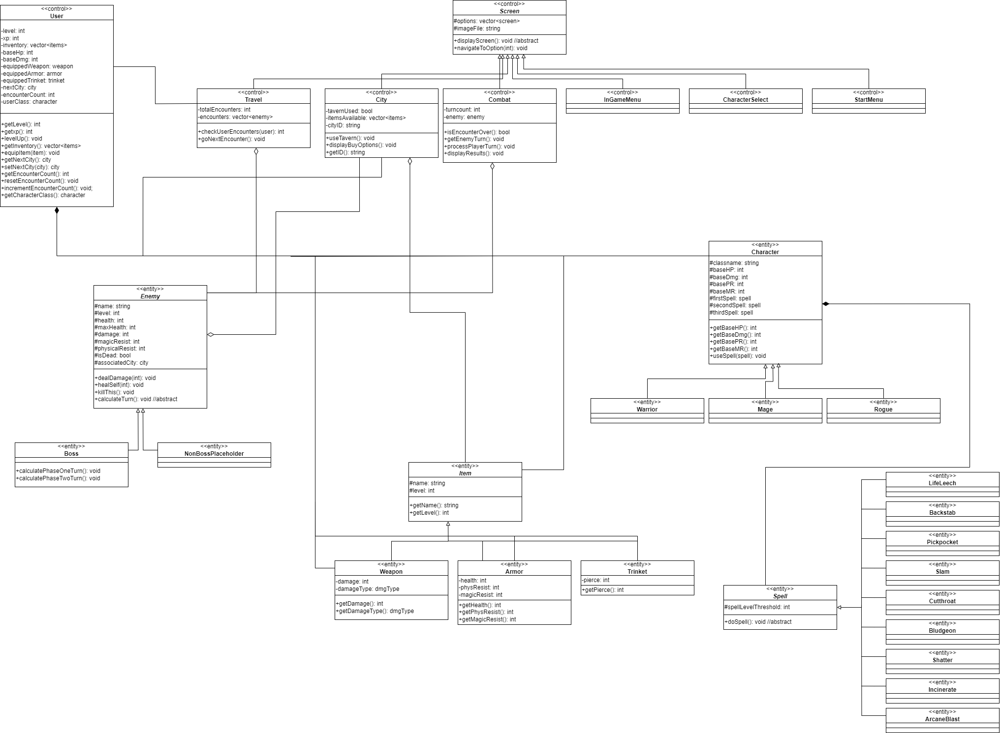

# Text Based Adventure
 
Authors: [Quin Gill](https://github.com/qhgill), [David Hannah](https://github.com/DavidRHannah), [James Liu](https://github.com/jliu0411), [Bestin Watts](https://github.com/BestinMW), [Bruce Riazi](https://github.com/r-bruce)

## Project Description
 * This project is interesting to us because we can implement new ideas and be creative with the story and structure of our game, while also using skills we've learned in past classes to make the game more complex and enjoyable.
 * We will be using C++ and CMake to develop the project.
 * The program will prompt the user with options based on their current situation. input for these options will either be a single character or a line of characters. the program will then read in the user's input and find the corresponding functions to call for that scenario. After the state of the game changes based on those functions, a display function will be called do output relevant information to the player.
 * The project will provide a character selection/creation system, a combat system for fighting enemies, and a movement system for the user to decide on the best course of action after every encounter. These systems will be used to structure a connected adventure the user can play through.

 > ## Phase II
 > In addition to completing the "User Interface Specification" and "Class Diagram" sections below, you will need to:
 > * Create an "Epic" (note) for each feature. Place these epics in the `Product Backlog` column
 > * Complete your first *sprint planning* meeting to plan out the next 7 days of work.
 >   * Break down the "Epics" into smaller actionable user stories (i.e. smaller development tasks). Convert them into issues and assign them to team members. Place these in the `TODO` column (aka Sprint Backlog).
 >   * These cards should represent roughly 7 days worth of development time for your team. Then, once the sprint is over you should be repeating these steps to plan a new sprint, taking you until your second scrum meeting with the reader in phase III.
 > * Schedule two check-ins using Calendly. Both time slots should be during your lab on week 6. Your entire team must be present for both check-ins.
 >   * The first check-in needs to be scheduled with your lab TA. During that meeting, you will discuss your project design/class diagram from phase II.
 >   * The second check-in should be scheduled with a reader. During that meeting you will discuss:
 >     * The tasks you are planning for the first sprint
 >     * How work will be divided between the team members
## User Interface Specification
 > Include a navigation diagram for your screens and the layout of each of those screens as desribed below. For all the layouts/diagrams, you can use any tool such as PowerPoint or a drawing program. (Specification requirement is adapted from the User Interface Design Document Template of CMSC 345 at the University of Maryland Global Campus)

### Navigation Diagram
The user begins at the Start Menu Screen which prompts the user to start the game, which takes the user to the character selection screen, after selecting a character they will arrive at the in game menu, where they can enter the travel screen. This screen will be displayed in between combat encounters and key locations, and the user can re-open the in game menu from this screen whenever they wish. When coming across a combat encounter, they will be moved to the combat screen for the duration of the encounter, and returned to the travel screen when the encounter is over. When arriving at a key location, the user can enter and exit the location screen from the travel screen. The user can also open the menu screen when viewing the location screen. From the in game menu, the user can also view their inventory or choose to quit the game, which will display the inventory screen or return to the start menu respectively.

### Screen Layouts
> Include the layout of each of your screens. The layout should describe the screen’s major components such as menus and prompts for user inputs and expected output, or any graphical user interface components if applicable (e.g. buttons, text boxes, etc). Explain what is on the layout, and the purpose of each menu item, button, etc. If many screens share the same layout, start by describing the general layout and then list the screens that will be using that layout and the differences between each of them.

## Class Diagram
 Description placeholder

 
 
 > ## Phase III
 > You will need to schedule a check-in for the second scrum meeting with the same reader you had your first scrum meeting with (using Calendly). Your entire team must be present. This meeting will occur on week 8 during lab time.
 
 > BEFORE the meeting you should do the following:
 > * Update your class diagram from Phase II to include any feedback you received from your TA/grader.
 > * Considering the SOLID design principles, reflect back on your class diagram and think about how you can use the SOLID principles to improve your design. You should then update the README.md file by adding the following:
 >   * A new class diagram incorporating your changes after considering the SOLID principles.
 >   * For each update in your class diagram, you must explain in 3-4 sentences:
 >     * What SOLID principle(s) did you apply?
 >     * How did you apply it? i.e. describe the change.
 >     * How did this change help you write better code?
 > * Perform a new sprint plan like you did in Phase II.
 > * You should also make sure that your README file (and Project board) are up-to-date reflecting the current status of your project and the most recent class diagram. Previous versions of the README file should still be visible through your commit history.
 
> During the meeting with your reader you will discuss: 
 > * How effective your last sprint was (each member should talk about what they did)
 > * Any tasks that did not get completed last sprint, and how you took them into consideration for this sprint
 > * Any bugs you've identified and created issues for during the sprint. Do you plan on fixing them in the next sprint or are they lower priority?
 > * What tasks you are planning for this next sprint.

 
 > ## Final deliverable
 > All group members will give a demo to the reader during lab time. ou should schedule your demo on Calendly with the same reader who took your second scrum meeting. The reader will check the demo and the project GitHub repository and ask a few questions to all the team members. 
 > Before the demo, you should do the following:
 > * Complete the sections below (i.e. Screenshots, Installation/Usage, Testing)
 > * Plan one more sprint (that you will not necessarily complete before the end of the quarter). Your In-progress and In-testing columns should be empty (you are not doing more work currently) but your TODO column should have a full sprint plan in it as you have done before. This should include any known bugs (there should be some) or new features you would like to add. These should appear as issues/cards on your Project board.
 > * Make sure your README file and Project board are up-to-date reflecting the current status of your project (e.g. any changes that you have made during the project such as changes to your class diagram). Previous versions should still be visible through your commit history. 
 
 ## Screenshots
 > Screenshots of the input/output after running your application
 ## Installation/Usage
 > Instructions on installing and running your application
 ## Testing
 > How was your project tested/validated? If you used CI, you should have a "build passing" badge in this README.
 