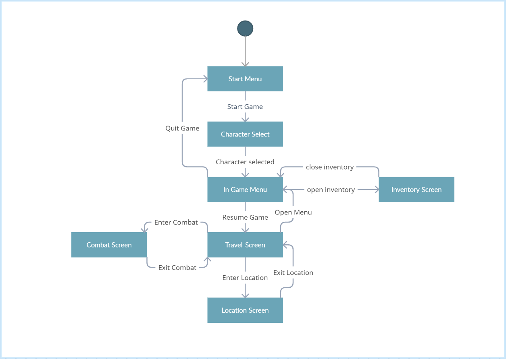
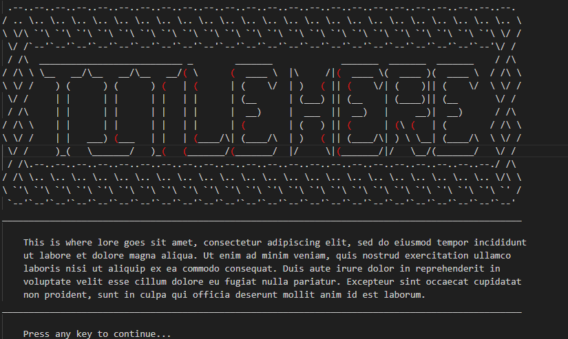
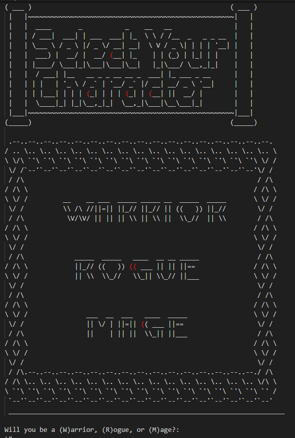
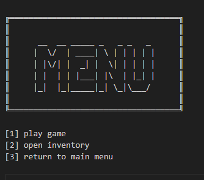
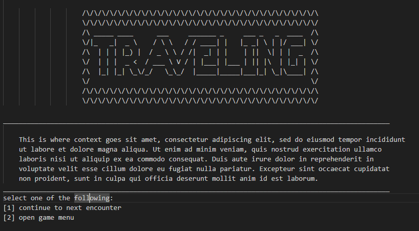
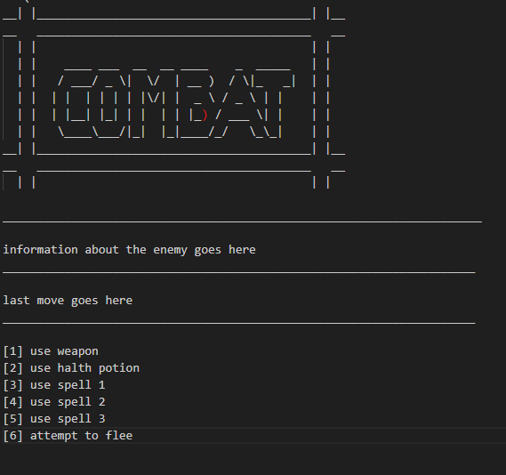
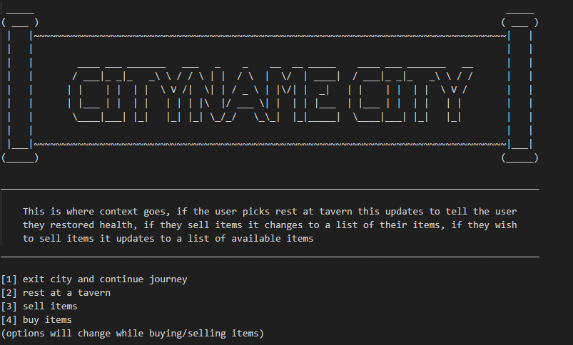
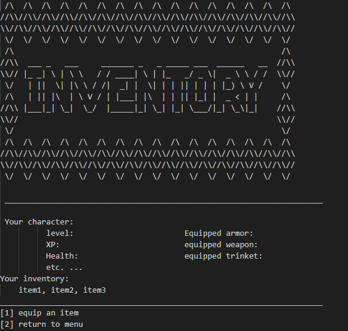
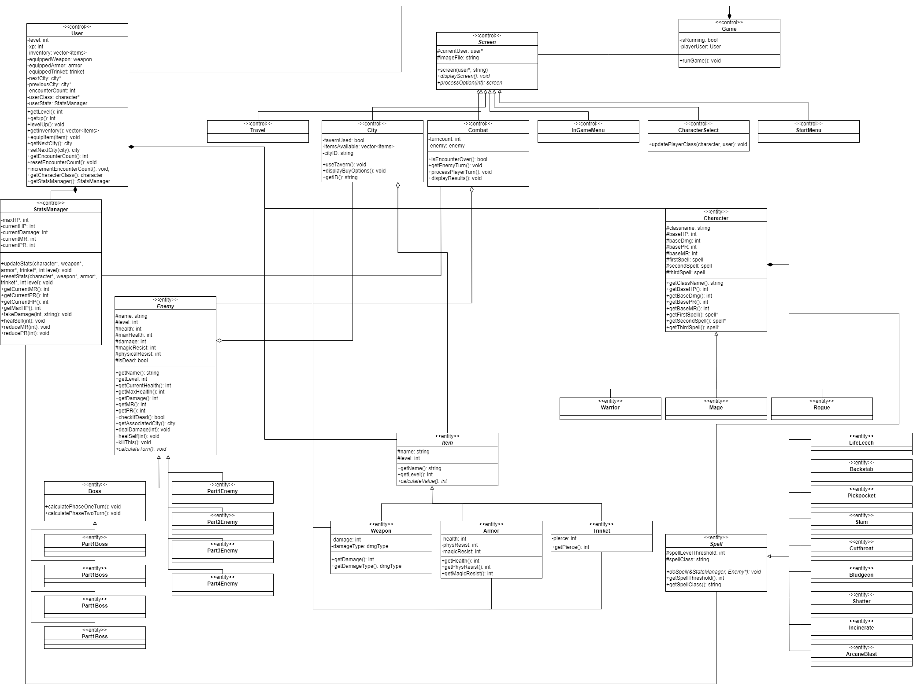

# Text Based Adventure
 
Authors: [Quin Gill](https://github.com/qhgill), [David Hannah](https://github.com/DavidRHannah), [James Liu](https://github.com/jliu0411), [Bestin Watts](https://github.com/BestinMW), [Bruce Riazi](https://github.com/r-bruce)

## Project Description
 * This project is interesting to us because we can implement new ideas and be creative with the story and structure of our game, while also using skills we've learned in past classes to make the game more complex and enjoyable.
 * We will be using C++ and CMake to develop the project.
 * The program will prompt the user with options based on their current situation. input for these options will either be a single character or a line of characters. the program will then read in the user's input and find the corresponding functions to call for that scenario. After the state of the game changes based on those functions, a display function will be called do output relevant information to the player.
 * The project will provide a character selection/creation system, a combat system for fighting enemies, and a movement system for the user to decide on the best course of action after every encounter. These systems will be used to structure a connected adventure the user can play through.
 * the player will play as a prince being sent by his father to take down his enemies, and will travel to each enemy and fight their subordinates along the way, at the end of the game, the player will discover that not everything is as it seems(a twist!)

## User Interface Specification
### Navigation Diagram
The user begins at the Start Menu Screen which prompts the user to start the game, which takes the user to the character selection screen, after selecting a character they will arrive at the in game menu, where they can enter the travel screen. This screen will be displayed in between combat encounters and key locations, and the user can re-open the in game menu from this screen whenever they wish. When coming across a combat encounter, they will be moved to the combat screen for the duration of the encounter, and returned to the travel screen when the encounter is over. When arriving at a key location, the user can enter and exit the location screen from the travel screen. The user can also open the menu screen when viewing the location screen. From the in game menu, the user can also view their inventory or choose to quit the game, which will display the inventory screen or return to the start menu respectively.

### Screen Layouts
The overall screen layout has an ASCII image at the top either showing the title of the page or an image for context, below it relevent information about the current state of the game is displayed, and below that options are listed for the player to choose from

* the starting screen displays the title of the game and a quick summary of the story, as well as prompting the user to continue

* the character select screen displays the options the player has to choose from for character class, and prompts the user to input a character corresponding to one of the choices to choose a character

* the menu screen displays "menu" as well as all of the options available while in the menu screen: returning to the game, quitting the game, or opening inventory

* the travel screen is meant to provide downtime for the player in between combat encounters, on the travelling screen the user will be given some context as to what they are doing and options to continue to the next encounter or open their menu

* the combat screen is entered whenever the player comes across a combat encounter, it displays information about their opponent, information about the last move made, and displays the options the user has to take action during the encounter, at the end of the combat encounter, a summary of progress and rewards is given, and the option to continue is shown

* the city screen serves as a space in between each section of the game and as a place for the user to do things like buy and sell equipment that aren't available in other places, making each city a place where key non-combat decisions are made, as well as a way for the backend to track the player's macro progress through the game. the city screen will display the name of the city, a short block of context, and prompt the user to choose an action while in the city

* the inventory screen is accessible through the menu screen and serves as a place for the user to view their current stats and equipped items, as well as any additional items they may have gotten through combat encounters. the screen displays this information above options the user can make while in the inventory screen. If the player chooses to equip an item, these options will change to allow the player to equip a specific item from their inventory

## Class Diagram
 * The User class handles information and functions related directly to the current user, such as keeping track of current equipment, current level, progress through the story, character class, and other user-related information. It can be thought of as an aggregation of objects under other classes with additional information and functionality that allow it to handle the user's overall progress and information.

 * The screen class handles displaying information to the user and navigating between screens/game states. The screen class itself is abstract and requires each inheriting class to override the displayScreen() and processOption() function, each subclass handles a specific game state/screen such as combat, main menu, etc.

 * The enemy class is an abstract object class that handles information for enemies the user encounters, the subclass is divided into boss and non-boss enemy types, which will behave slightly differently but have a lot of overlapping functionality. 

 * The item class handles information about items the player can find and equip throughout their play-through of the game, the parent class handles functionality that is common across all items such as base stats, while each subclass handles information specific to that item type. This class is associated with multiple other classes including the user and city classes.

 * The character class handles information specific to the character the user picks like base stats and spells, as well as being used by the user class in it's functions. Each subclass differs from the parent class primarily by which spell classes it uses.

 * The spell class is a component class of the character class, and handles information about specific spells regarding each class.

 
 
 > ## Phase III
 > You will need to schedule a check-in for the second scrum meeting with the same reader you had your first scrum meeting with (using Calendly). Your entire team must be present. This meeting will occur on week 8 during lab time.
 
 > BEFORE the meeting you should do the following:
 > * Update your class diagram from Phase II to include any feedback you received from your TA/grader.
 > * Considering the SOLID design principles, reflect back on your class diagram and think about how you can use the SOLID principles to improve your design. You should then update the README.md file by adding the following:
 >   * A new class diagram incorporating your changes after considering the SOLID principles.
 >   * For each update in your class diagram, you must explain in 3-4 sentences:
 >     * What SOLID principle(s) did you apply?
 >     * How did you apply it? i.e. describe the change.
 >     * How did this change help you write better code?
 > * Perform a new sprint plan like you did in Phase II.
 > * You should also make sure that your README file (and Project board) are up-to-date reflecting the current status of your project and the most recent class diagram. Previous versions of the README file should still be visible through your commit history.
 
> During the meeting with your reader you will discuss: 
 > * How effective your last sprint was (each member should talk about what they did)
 > * Any tasks that did not get completed last sprint, and how you took them into consideration for this sprint
 > * Any bugs you've identified and created issues for during the sprint. Do you plan on fixing them in the next sprint or are they lower priority?
 > * What tasks you are planning for this next sprint.
   
 Phase 3 changes(need to update description when final phase 3 class diagram is in):
   * split user class into user and stats manager
   * split non-boss enemy class
   * split boss enemy class
   * created higher level game module
   * non SOLID changes to make everything work cohesively
 
 > ## Final deliverable
 > All group members will give a demo to the reader during lab time. ou should schedule your demo on Calendly with the same reader who took your second scrum meeting. The reader will check the demo and the project GitHub repository and ask a few questions to all the team members. 
 > Before the demo, you should do the following:
 > * Complete the sections below (i.e. Screenshots, Installation/Usage, Testing)
 > * Plan one more sprint (that you will not necessarily complete before the end of the quarter). Your In-progress and In-testing columns should be empty (you are not doing more work currently) but your TODO column should have a full sprint plan in it as you have done before. This should include any known bugs (there should be some) or new features you would like to add. These should appear as issues/cards on your Project board.
 > * Make sure your README file and Project board are up-to-date reflecting the current status of your project (e.g. any changes that you have made during the project such as changes to your class diagram). Previous versions should still be visible through your commit history. 
 
 ## Screenshots
 > Screenshots of the input/output after running your application
 ## Installation/Usage
 > Instructions on installing and running your application
 ## Testing
 > How was your project tested/validated? If you used CI, you should have a "build passing" badge in this README.
 