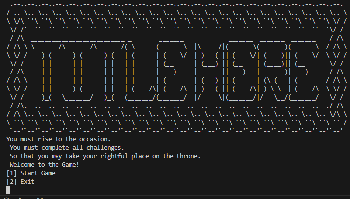
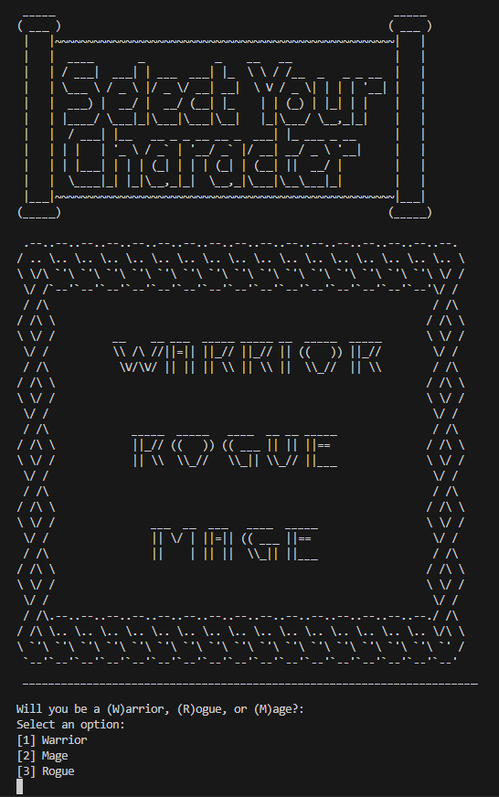
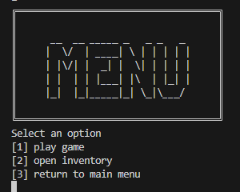
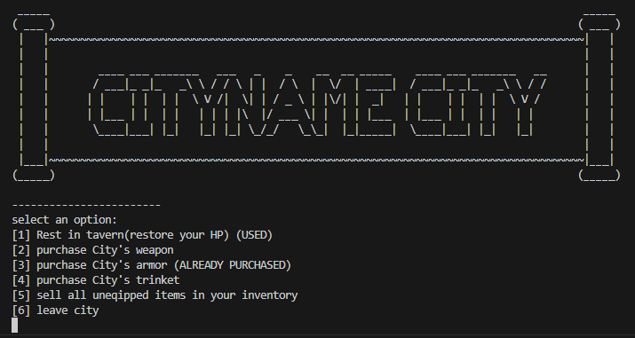
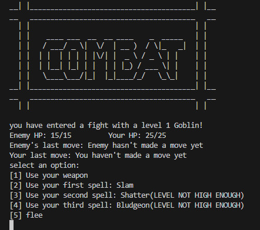
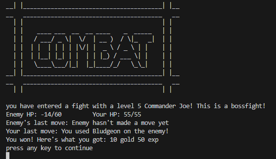
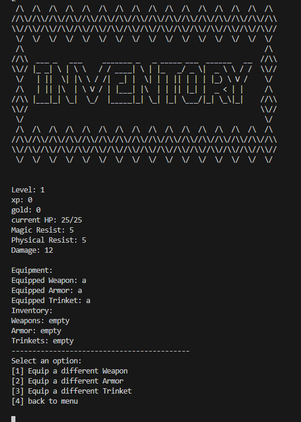
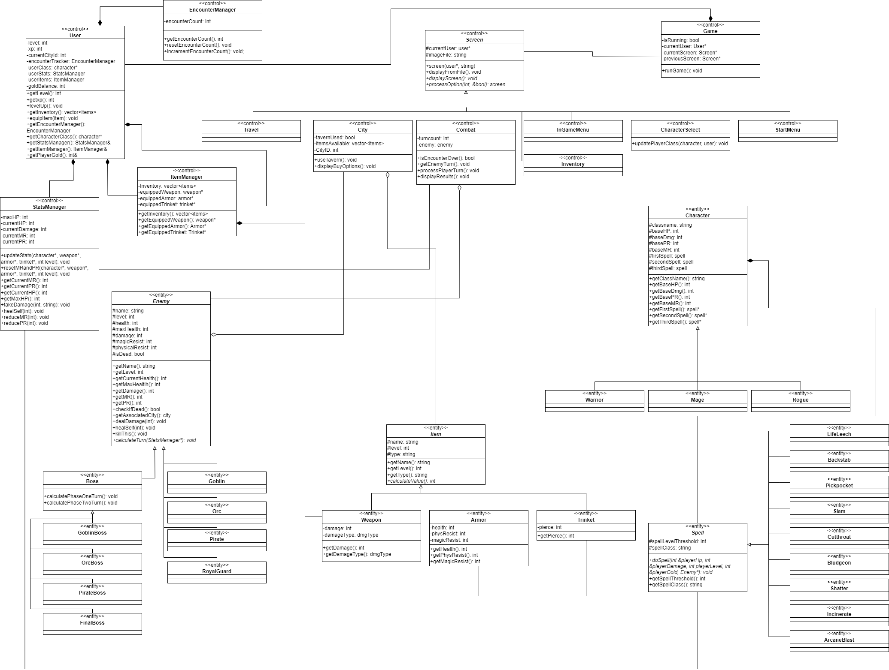

# Text Based Adventure
 
Authors: [Quin Gill](https://github.com/qhgill), [David Hannah](https://github.com/DavidRHannah), [James Liu](https://github.com/jliu0411), [Bestin Watts](https://github.com/BestinMW), [Bruce Riazi](https://github.com/r-bruce)

## Project Description
 * This project is interesting to us because we can implement new ideas and be creative with the story and structure of our game, while also using skills we've learned in past classes to make the game more complex and enjoyable.
 * We will be using C++ and CMake to develop the project.
 * The program will prompt the user with options based on their current situation. input for these options will either be a single character or a line of characters. the program will then read in the user's input and find the corresponding functions to call for that scenario. After the state of the game changes based on those functions, a display function will be called do output relevant information to the player.
 * The project will provide a character selection/creation system, a combat system for fighting enemies, and a movement system for the user to decide on the best course of action after every encounter. These systems will be used to structure a connected adventure the user can play through.
 * the player will play as a prince being sent by his father to take down his enemies, and will travel to each enemy and fight their subordinates along the way, at the end of the game, the player will discover their father betrayed them and fight him as the final boss.

## User Interface Specification
### Navigation Diagram
The user begins at the Start Menu Screen which prompts the user to start the game, which takes the user to the character selection screen, after selecting a character they will arrive at the in game menu, where they can enter the travel screen. This screen will be displayed in between combat encounters and key locations, and the user can re-open the in game menu from this screen whenever they wish. When coming across a combat encounter, they will be moved to the combat screen for the duration of the encounter, and returned to the travel screen when the encounter is over. When arriving at a key location, the user can enter and exit the location screen from the travel screen. The user can also open the menu screen when viewing the location screen. From the in game menu, the user can also view their inventory or choose to quit the game, which will display the inventory screen or return to the start menu respectively.

### Screen Layouts/Output
The overall screen layout has an ASCII image at the top either showing the title of the page or an image for context, below it relevent information about the current state of the game is displayed, and below that options are listed for the player to choose from

 

* the starting screen displays the title of the game and a prompt for the user to start the game or quit

* the character select screen displays the options the player has to choose from for character class, and prompts the user to input a number corresponding to their chosen character class

 

* the menu screen displays "menu" as well as all of the options available while in the menu screen: returning to the game, quitting the game, or opening inventory

* the travel screen is meant to provide downtime for the player in between combat encounters, on the travelling screen the user can open their menu or continue to the next combat encounter.

 

 

* the combat screen is entered whenever the player comes across a combat encounter, it displays information about their opponent, information about the last move made, and displays the options the user has to take action during the encounter, at the end of the combat encounter, a summary of progress and rewards is given, and the option to continue is shown

* the city screen serves as a space in between each section of the game and as a place for the user to do things like buy and sell equipment that aren't available in other places, making each city a place where key non-combat decisions are made, as well as a way for the backend to track the player's macro progress through the game. the city screen will display the name of the city, a short block of context, and prompt the user to choose an action while in the city

* the inventory screen is accessible through the menu screen and serves as a place for the user to view their current stats and equipped items, as well as any additional items they may have gotten. the screen displays this information above options the user can make while in the inventory screen.

## Class Diagram
 * The User class handles information and functions related directly to the current user, such as keeping track of current equipment, current level, progress through the story, character class, and other user-related information. It can be thought of as an aggregation of objects under other classes with additional information and functionality that allow it to handle the user's overall progress and information.

 * The screen class handles displaying information to the user and navigating between screens/game states. The screen class itself is abstract and requires each inheriting class to override the displayScreen() and processOption() function, each subclass handles a specific game state/screen such as combat, main menu, etc.

 * The enemy class is an abstract object class that handles information for enemies the user encounters, the subclass is divided into boss and non-boss enemy types, which will behave slightly differently but have a lot of overlapping functionality. 

 * The item class handles information about items the player can find and equip throughout their play-through of the game, the parent class handles functionality that is common across all items such as base stats, while each subclass handles information specific to that item type. This class is associated with multiple other classes including the user and city classes.

 * The character class handles information specific to the character the user picks like base stats and spells, as well as being used by the user class in it's functions. Each subclass differs from the parent class primarily by which spell classes it uses.

 * The spell class is a component class of the character class, and handles information about specific spells regarding each class.

 

   
### Phase 3 changes to UML Diagram:
  * We split the user class by making it a composition of other classes to reduce responsibilities
  * We split the non-boss enemy classes to add variety to the enemies we implement, each would implement their actions differently so by splitting into these subclasses we allow for extension later
  * split boss enemy class for a similar reason to splitting non-boss enemies, but because boss enemies are slightly different we split them seperately
  * created a game class to manage the game when it runs and remove excess responsibilities from other classes
  * made some adjustments to how user, character, spell, and enemy works to make sure we didn't have circular dependencies and make things work with the rest of our changes
### SOLID Principles
  * Single responsibility principle: Our new class diagram adheres to the single responsibility principle by splitting classes up into compositions and inheritence structures that reduce the responsibilities of individual classes. For example, our User class used to have multiple responsibilities to keep track of, but now that responsibility has been split into multiple component classes to adhere to the SRP. Before our changes, classes like our Screen class and its subclasses as well as the spell class and its subclasses also followed this principle, as each screen subclass is only responsible for one screen the user sees, and each spell subclass is only responsible for one spell. 
  * Interface Segregation principle: Our class diagram adheres to the Interface segregation principle through the boss subclass. Each boss has a set of seperate functions for different phases of a fight, differing slightly from regular enemies, as a result, we split the interface for bosses to have an extra class in between the enemy parent class and the lowest level of individual boss classes. This follows Interface Segregation principle because it means regular enemies are not forced to implement functions that only bosses need. 
  * Liskov Substitution Principle: Our class diagram adheres to the Liskov Substitution principle through examples like our spell and enemy class. Although they are both abstract classes, any child class of these parent classes can replace one another. Our program uses spell pointers and enemy pointers to store different subclasses of each class, and due to the inheritence structure, any spell pointer can store any spell subclass, and any enemy pointer can store any enemy subclass. This is also the case for our screen subclasses, each screen subclass can replace each other within a pointer for the parent class.
 
 # Final deliverable
 ## Screenshots
 Please refer to screen layouts section for screenshots of the game running 

 ## Installation/Usage
 1. Clone the repository(if you want to run the tests clone recursively)
 2. run cd final-project-qgill001-dhann013-jliu659-bwatt004
 3. run cmake .
 4. run make
 5. run ./source/mainExecutable
 6. enjoy the game!
 ## Testing
 We used Googletest to unit test our project. Each time a feature was implemented, the person who implemented it created tests to verify the functionality of the feature/component. There are some cases where tests were implemented later when functionality was more clear and other cases where more tests were added when functionality for those classes changed. Tests were also added towards the end of the project to ensure code coverage was as close to 100% as possible.
 